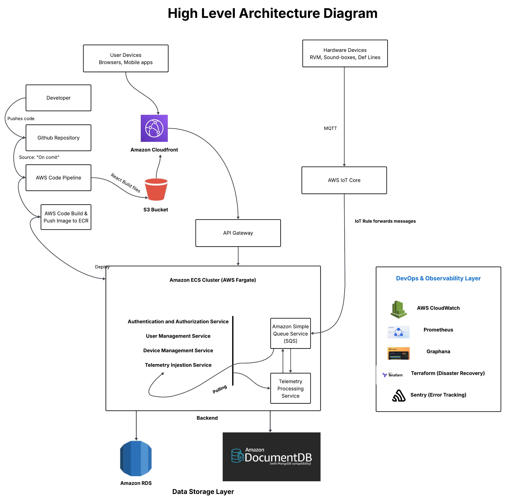

# 🏗️ Application Architecture

The Revolv Device Manager follows a typical client-server architecture...

## 🔄 Flow Overview

- Frontend (React) → API calls → Backend (Express) → Database (SQLite)

## 🖼️ Architecture Diagram

### **1\. System Architecture Proposal**

**High Level Architecture Design Explanation**

The architecture is structured as a **modular monolith** deployed on **Amazon ECS (Fargate)**, following a **cloud-native**, **microservices-oriented** approach using **Amazon Web Services (AWS)**. It allows fast initial development while maintaining logical separation between services. The architecture is intentionally designed so individual services (e.g., **telemetry ingestion**, **user management**) can be extracted into independent microservices when scaling is required.	It is also designed to meet the core business requirements of security, reliability, and maintainability.

This modular backend is complemented by a **frontend UI (**basically a **React app) hosted on S3 \+ CloudFront**, and the system supports **real-time telemetry, secure APIs, and CI/CD workflows.**

1. **Scalable Micro-services Architecture:** 

   The backend logic is broken down into small, independent services which are hosted on Amazon ECS Cluster running on AWS Fargate. AWS Fargate is a serverless compute engine for containers which scales automatically horizontally based on demand. The hardware communicates with the Telemetry Processing Services with the Amazon SQS for passing message queues. So failure in this service does not impact on the other services like user-management.

2. ### **Secure backend with RBAC:**

   Authentication and Authorization are handled by a dedicated service inside the ECS Cluster.  Upon login, the system issues JWT tokens containing user roles (admin, technician, supervisor, etc.). **RBAC** is enforced via **middleware** in the backend that inspects the user's role and grants or denies access to specific endpoints.

   Passwords are stored securely using hashing (e.g., **bcrypt**), and secrets are managed via **AWS Secrets Manager.**

   

3. **Realtime Device Telemetry Support:**

   Hardware devices like RVMs and Soundboxes send telemetry (using the lightweight **MQTT** protocol) to the platform via **AWS IoT Core**. According to the rule set in the IoT Core, the messages are sent to the **Amazon Simple Queue Service (SQS)** instead of directly sending it to the backend. **Amazon SQS** is placed in between the MQTT protocol and the backend so that it can preserve the data and there is no data loss when the backend service is busy or unavailable. The **Telemetry Processing Service** then polls the SQS queue to process and store the data in Amazon DocumentDB (MongoDB-compatible) for time-series querying, and it also ensures high availability. 

   

4. **Dashboard/UI with Efficient State Management:**  
* **Hosting:** The frontend is built in [React.js](http://React.js). The static build files (like html, css, Javascript) are stored in the S3 bucket.  
* **Global Delivery via Amazon Cloud-Front**: The application is served world-wide through the Content Delivery Network service namely **Amazon Cloud Front**. It caches the file at edge locations around the world, thus ensuring **low-latency**, **high-availability** for users.  
* **Efficient State Management:** **Zustand** or **Redux** may be used for state management while **React-Query** may be used for data-fetching to ensure managing server state, handling caching, background re-fetching.

5. **Multi-Environment Deployment Pipeline:**

   

   The platform supports multiple environments:

* Dev (developer testing)  
* State (pre-production)  
* Prod (live application)

* **Workflow:** When a developer pushes code to the **GitHub Repository**, it automatically triggers an **AWS CodePipeline**.  
* **Build & Test:** The pipeline's first stage uses **AWS CodeBuild** to run a series of automated tests. If the tests pass, CodeBuild builds a new **Docker image** of the application and pushes it to the **Amazon ECR (Elastic Container Registry)**.  
* **Deployment:** In the final stage, the pipeline instructs **Amazon ECS** to perform a zero-downtime rolling update, gradually replacing the old application containers with the new version from ECR.  
* **CloudFront invalidation** is triggered to ensure fresh content delivery for the UI.

6. **System Observability:**

   To maintain system health and reliability, the architecture includes:

* **Logging**: **AWS CloudWatch** serves as the central **logging solution**, aggregating logs from all services, **including ECS**, **API Gateway**, and **IoT Core**.  
* **Metrics & Dashboards**: **Prometheus** is used to grab detailed performance metrics from the backend services. These metrics are then visualized in **Grafana** dashboards to monitor **system health**, **performance**, and **key business indicators** in **real-time**.  
* **Error Tracking**: **Sentry** is integrated into both the frontend and backend applications to provide **real-time error tracking**. When an exception occurs, Sentry captures it and alerts the development team immediately, so that bug can be fixed instantly.  
* **Infrastructure as Code**: **Terraform** is used to define and manage the entire cloud infrastructure as code. This ensures that the infrastructure is version-controlled, easily repeatable across environments, and can be quickly rebuilt in a disaster recovery scenario.

7. **Technology Stack Choices:**  
* **Frontend:** React, Zustand, Tailwind CSS  
  * Reason: Fast Development, flexible UI, Component-based  
* **Backend**: NodeJS (ExpressJS), TypeScript  
  * Reason: Scalable, Type safe, modular REST API  
* **API Gateway**: AWS API Gateway  
  * Reason: Security, Rate-limiting, centralized routing  
* **Auth**: JWT, RBAC  
  * Reason: Stateless, Secure token base access control  
* **Realtime Queue**: AWS SQS  
  * Reason: Highly available, data retention,  
* **CI/CD**: Github Actions, CodeBuild, CodePipeline  
  * Reason: Fast and Automated deployments  
* **Observability**: AWS CloudWatch, Prometheus, Graphana, Sentry  
  * Reason: Complete visibility for logs, metrics, errors  
* **Secret Management**: AWS Secret Manager  
  * Reason: Safe storage for credentials  
       
8. **Database Model:**

   a. **Amazon RDS (PostgreSQL)** – For structured data:

* Users Table  
* Devices Table  
* Sessions Table

		b. **Amazon DocumentDB (MongoDB)** – For telemetry logs:

* JSON structured Telemetry logs

9. **API Design Strategy:**  
* **Protocol: REST** (easier to implement/test; good ecosystem support, widely understood standard)  
* **Docs: OpenAPI (Swagger)** autogenerated from backend routes

### **4\. System SLA (Service Level Agreement) Planning and Reliability Practices**

* **99% Uptime:**   
1. Multi-zone AWS ECS needs to be implemented. The application may be deployed in at least two AWS **Availability Zones**. For example, **ap-south-1a** and **ap-south-1b** zones under the **ap-south-1** region may be used for deploying backend services.

2. Use of Application Load Balancer to distribute traffic.

3. Amazon **ECS** (**Elastic Container Service**) may be used to auto scale the application based on the CPU or memory usage. If an application container fails a **Health Check**, ECS automatically stops it and launches a new one. It also integrates well with CI/CD pipelines. So we need to build the docker image and push it to the Amazon Elastic Container Registry. Next, creating ECS Cluster (Fargate or EC2 Linux \+ Networking), Task definition in ECS console with load balancer will create the whole service.

4. AWS **CloudFront CDN** for React application is required. We may host it on **Amazon S3** and use **Amazon Cloud Front** as **Content Delivery Network** for low-latency as well as for global availability. It caches frontend assets like JavaScript code, Images, CSS in the edge location. 

   

* **Role-Based Access Control:**  
  We can do this in two ways: 1\. Using AWS Cognito Service and 2\. Manual JWT and RBAC setup.  
    
1. **Using AWS Incognito:** This simplified identity management. This handles signing up users, handling passwords and MFA, forgot-password flows etc. It has its own user directory and user groups (e.g., Admins, Operators, Supervisors) and upon signing up a new user and authentication, it assigns JWT based standard tokens like ID Token, Access Token and Refresh Token. The authentication handles these tokens to authenticate the valid users from the backend using AWS Incognito.

   

   In the backend Authorization middleware would run after Authentication middleware has completed its execution. In this Authorization middleware, the RBAC is enforced. It accesses user groups from the Incognito and defines each API route for its role and access mechanism. So in this way only RBAC is achieved.

   

2. **Using Manual JWT and RBAC setup:**   
1. User management and JWT:   
* **Database with Users Schema**: Users table with columns viz., *id (PK), username (unique), email (unique), password\_hash (bcrypted), role\_id (FK from roles table), created\_at, updated\_at.*  
* **User registration end-point (POST /register)**: Here we will accept user name, email and password, hash the password using bcrypt and store it in the users table.  
* **User login end-point (POST /login)**: Here we accept user name or email and password and then retrieve the record from the users table and compare the password. If password is matched then JWT token is generated which would include signed token using secret key and payload (consisting user\_id, role, user\_name, iat (issued at), exp (expiration time).   
* Next we return the token to the client.  
2. Frontend handling:   
* Store the token safely in session storage or local storage (less secure, so not to follow this). If the token is httpOnly, then it is already a secured token and can be managed very well.  
* We need to include the JWT in the Authorization header (Authorization: Bearer \<Token\>) for all subsequent API requests to the protected routes to the server.  
3. Backend JWT validation middleware:   
* Creates a middleware function for every protected API route.  
* Extract the JWT from the Authorization header.  
* Verify JWT’s signature with the secret key and token expiration.  
* If found valid, then decode the token and attach user’s information to the request object., like req.user \= {id: …, role: …}  
* If invalid, 401 Unauthorized is returned.   
4. Authorization (RBAC):  
* Role Table: It would contain id (PK), name (unique, e.g., Admin, Supervisor)  
* Role assignment to be done while creating a new user.  
* Authorization middleware accepts a list of roles that are allowed to access a specific route.  
* It checks req.user.role to the accepted list of roles and if it is found it, the user is allowed to that route.  
* If not, 403 forbidden is returned.  
* We need to apply this middleware in our protected APi routes.

* **Secure data storage:**  
1. **Data Encryption**: Configuring **TLS** on the **API gateway**, implementing **SSL**, not allowing port **80** and allowing data transfer only through secured ports like **443** may be done.  
2. **Using AWS Secret manager**: This can be used to store Database credentials, API keys and other secrets. Hardcoding secrets in the codebase should be avoided. 

* **Proactive Monitoring and System errors:**   
    
1. **Prometheus** can be used to collect detailed metrics from the services (API/server).  
2. **Graphana** can be used for creating dashboards that visualize health, uptime etc.  
3. **Sentry** for realtime error tracking and performance.   
4. **AWS CloudWatch Alarms** can also be used here to track high error rates.

* **Backup and Disaster Recovery:**   
    
1. For PostgreSQL, if we’re using **Amazon RDS**, then it has built-in automated backups and snapshots. We can configure it to daily automated snapshots to backup database instances. Also we can set a retention period for approximately 35 days.   
2. For MongoDB, we may use **Point-in-time recovery (PITR)** if using **Amazon document DB clusters**. It is a robust backup strategy that backs up huge amounts of data with a given retention period.  
3. Application code can be stored in Github with a version control system like Git. Environment variables can be stored securely in AWS secret manager.  
4. Regular Restore procedures also need to be followed. We may periodically perform test-restores of both the databases.  
     
   **DISASTER RECOVERY**: **Terraform** can be used here for faster recovery. **Terraform** can be used to define the ‘***entire infrastructure*** (including all the services like **EC2/Fargate**, **load balancers**, **RDS** etc) ***as code***’ (IaC). We need to store the **IaC templates** in version control. In a DR scenario, we can rapidly provision a complete replica of this infrastructure by simply executing the IaC templates. This eliminates manual configuration errors and speeds up recovery.  
     
     
     
* **CI/CD with Frontend (S3) and Backend (ECS):**  
    
1. **Continuous Integration (CI)**  
* **Code Commit:** Code is being pushed to a version control system like Git.  
    
* **Automated Build (Frontend)**: The CI pipeline runs commands (e.g., ***npm install, npm run build***) to compile the React/TypeScript frontend code into static assets (HTML, CSS, JavaScript).  
    
* **Automated Build (Backend)**: The CI pipeline runs commands (e.g., ***npm install***) for the Node.js backend. A **Docker** image for the backend application is then built.  
    
* **Artifact Creation**: The built Docker image for the backend is pushed to **Amazon Elastic Container Registry (ECR)**. The static assets for the frontend are also prepared.  
    
2. **Continuous Deployment (CD)**  
     
* **Backend Deployment (to Amazon ECS)**: The CD pipeline updates the Amazon ECS Service with the newly Docker image from the **ECR**. **ECS** (using the Fargate or EC2 launch type) then automatically handles the deployment by **pulling the new imag**e and performs **a rolling update** to launch new containers and terminate old ones, minimizing downtime.  
    
* **Frontend Deployment (to Amazon S3 & CloudFront)**: The CD pipeline uploads the static frontend assets directly to the designated Amazon S3 bucket. The pipeline then triggers a CloudFront cache invalidation to ensure that CloudFront's edge locations immediately serve the new frontend files, rather than outdated cached versions.

### **5\. Team Scaling and Engineering Culture**

* **Team Structure**: Initially development may start with a monolithic type “**Full Stack Development**” team responsible for the entire project. As the system and team grows I will split them into domain-specific squads like a team for “Device & Telemetry” squad and a “Platform & Analytics” squad to introduce “micro-services”. Each team will maintain the work velocity and ownership of the development process.

* **Coding Standards and Review**: Using tools like ESLint and Prettier to automate formatting and catching errors. Whereas, codeowners will be used for Code Review purposes. I will mandate Pull Requests (PRs) for all code changes in Github. Then I would require at least one approval from my peer before the code gets merged into the main/master branch. 

* **Onboarding and Knowledge Transfer:**   
  * **Documentation**: I will use **Notion** or **Excallidraw** for architectural diagrams, work flows, business logic, setup guides and coding patterns.  
  * **Onboarding Plan**: Handbook, Walkthrough videos can be used here. I would also create a structured plan for new engineers that includes the setting up of the local environment, pairing with senior developers and developing a non-critical task first.

* **Fostering a strong culture**:   
  * **Ownership**: I would assign clear ownership of services or features to the individuals or squads.  
  * **Testing**: Would follow a strong base of unit tests, followed by integration and end-to-end tests.  
  * **Continuous** Improvement: Hold an attitude to learn from the mistakes. Also I will consult with the peers to know what’s working and what’s not and take action on it for improvement.

