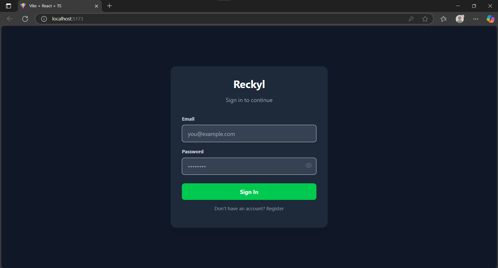
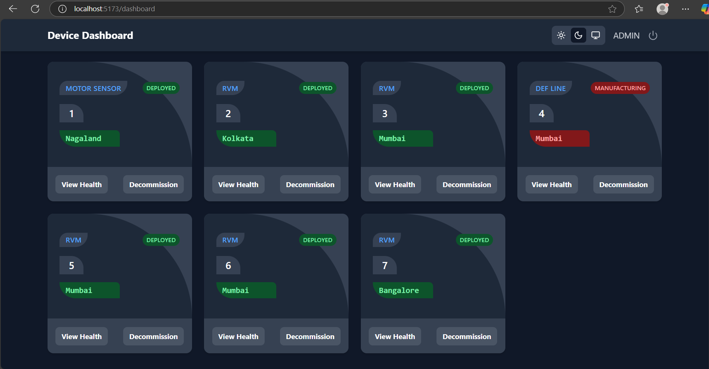
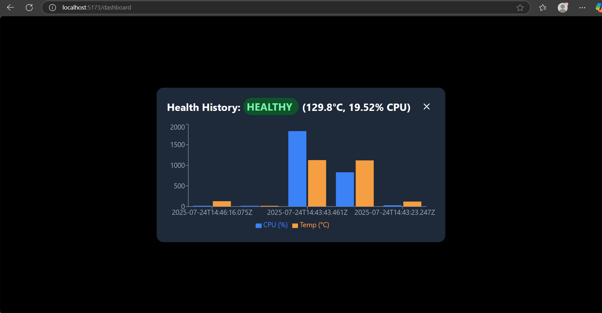
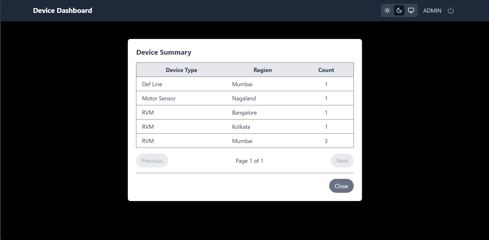
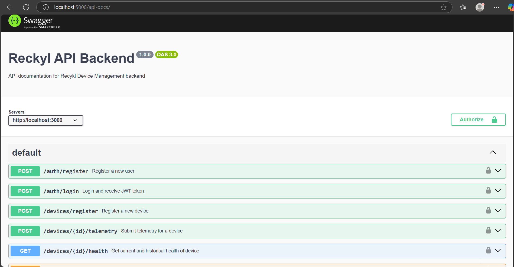

# Revolv Device Manager - Full Stack Application

## 📦 About the Project

The **Revolv Device Manager** is a full-stack web application built with:

- **Frontend:** React (with TypeScript + TailwindCSS)
- **Backend:** Node.js (Express + TypeScript)
- **Database:** SQLite
- **Auth:** JWT-based authentication
- **Features:** Role-based access (Admin/User), Device management, Health telemetry tracking and adding, Recharts for visualization, Best Security Practices, Preventing Cross-Scripting, API Rate Limitation, Throttling, Caching with Node-Cache, Field Validation, Input Sanitization, Cookie Based Authorization, Contexts for Theme and User, Theme Toggling, Responsiveness and so on.

---


# Architecture Details with Diagram
Please follow the details for architecture details including planning, and accompanying explanation

Follow: - [ARCHITECTURE.md](./ARCHITECRURE.md) file.

The following goals have been covered: 

- Scalable **microservices** or modular monolith architecture
- Secure backend with role-based access control **(RBAC)**
- Real-time device telemetry support
- Dashboard/UI with efficient state management
- Multi-environment deployment pipeline (dev/stage/prod)
- System observability (logging, metrics, alerting)

## 🚀 Features

- ✅ User Registration and Login with JWT
- ✅ Role-based UI rendering (Admin/User)
- ✅ Admin can:
  - Register new devices
  - View device status
  - Add & view health telemetry
  - Decommission devices
- ✅ Device health tracking (CPU, Temperature)
- ✅ Dark and Light theme toggle
- ✅ Responsive Grid and Table views for device listing
- ✅Recharts for visualization
- ✅API Rate Limitation using `express-rate-limit`
- ✅Throttling by using `express-slow-down`, Caching with Node-Cache
- ✅Input Sanitization, Cookie Based Authorization,

---


## 📦 Folder Structure

```

recyklFullStack/
├── recykl-frontend/       # React app (Vite + TailwindCSS)
├── recykl-backend/        # Node.js + Express backend
├── README.md              # Project overview and setup

```

## Setup Instructions

---

## 🛠️ Setup Instructions

### 🔧 Prerequisites

- Node.js ≥ 20
- SQLLite Database
- Git

---

### 1️⃣ Backend Setup

```bash
git clone https://github.com/Pankaj89Acharjee/recyklFullStack.git
cd recyklFullStack
cd recykl-backend
npm install
npx prisma generate      # If using Prisma ORM
npm run dev              # Starts the server

```

### 2️⃣ Frontend Setup

```bash
cd ../recykl-frontend
npm install
npm run dev              # Starts Vite dev server
```

- Frontend will be available at: http://localhost:5173
- Backend will be available at: http://localhost:5000


## 📚 Tech Stack / Libraries Used

📦 Tech Stack & Libraries

**Frontend**:
- React + Vite + TypeScript
- TailwindCSS
- React Router DOM
- React Hook Form
- Recharts
- React Toastify
- Lucide Icons
- Axios / fetch API

**Backend**:
- Express.js
- TypeScript
- Sequelize ORM (or Prisma if using)
- SQLite
- JWT (jsonwebtoken)
- bcrypt
- express-rate-limit, express-slow-down
- cookie-parser
- cors
- joi / express-validator
- node-cache


## Environment Variables

```bash

# .env (backend)
PORT=5000
JWT_SECRET=your_jwt_secret
DATABASE_URL=file:./dev.db
NODE_ENV=development

```
**You don’t need to include actual values, just key names.**


## 🧪 Testing

- Backend: Jest + Supertest
- Run tests using:
```bash
npm run test
```


## ✅ API Routes

```bash

| Method | Endpoint               | Description              | Protected |
|--------|------------------------|--------------------------|-----------|
| POST   | /auth/register         | Register a new user      | ❌        |
| POST   | /auth/login            | Login and get token      | ❌        |
| GET    | /devices/allDevices    | Fetch all devices        | ✅        |
| POST   | /devices/register      | Register new device      | ✅ (admin)|
| POST   | /devices/:id/telemetry | Add telemetry data       | ✅        |
| GET    | /devices/:id/health    | View telemetry history   | ✅        |
| PATCH  | /devices/:id/decommission    | Decommission device      | ✅ (admin)|
| GET    | /devices/summary       | View summary             | ✅        |

```

## 📸 Screenshots

### 🔐 Login/Landing Screen
- **API Endpoint** - /auth/login 


### 🔐 Dashboard Screen
- **API Endpoint** - /devices/allDevices 


### 🔐 Login/Landing Screen
- **API Endpoint** - /devices/:id/health 


### 🔐 Summary Screen
- **API Endpoint** - /devices/summary 



## Swagger - API Docs
- http://localhost:5000/api-docs/

### Swagger Screen
